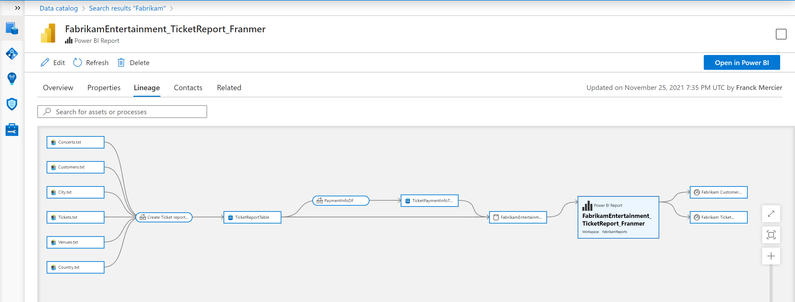
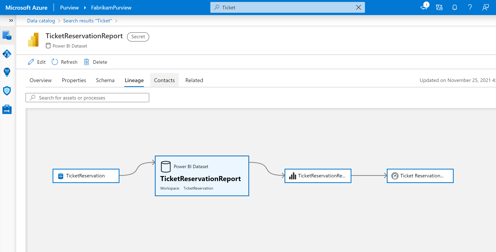
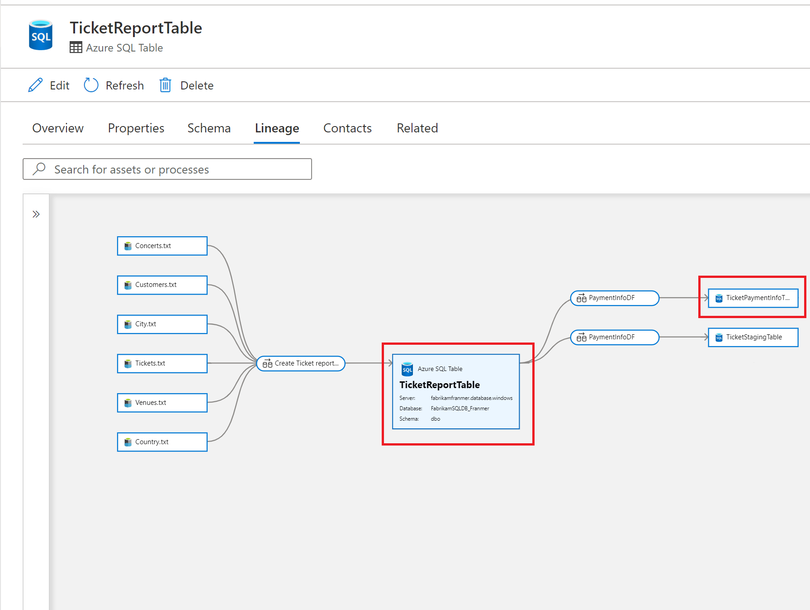
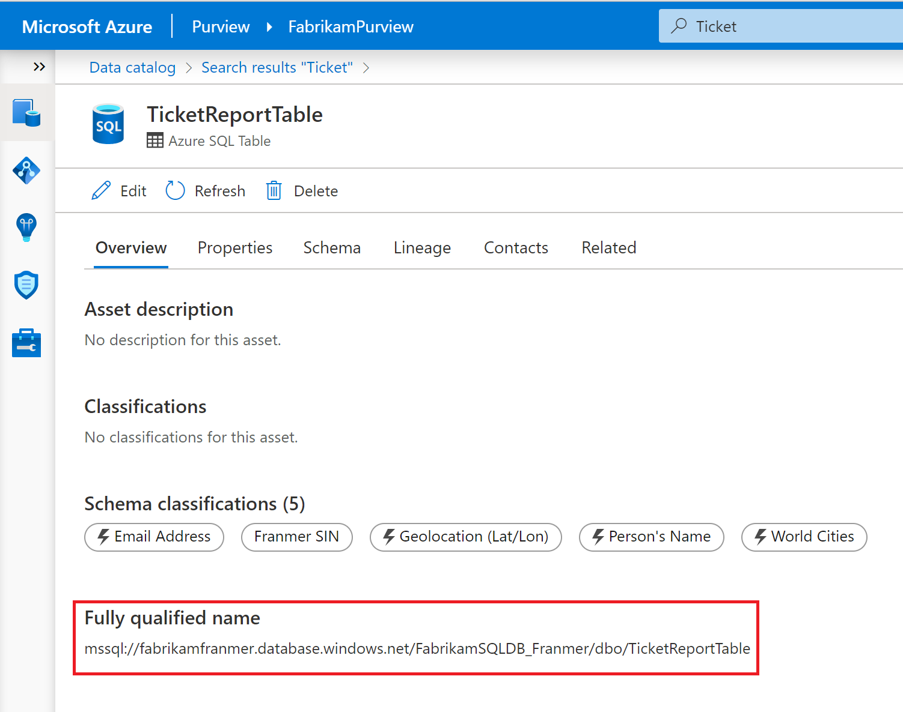
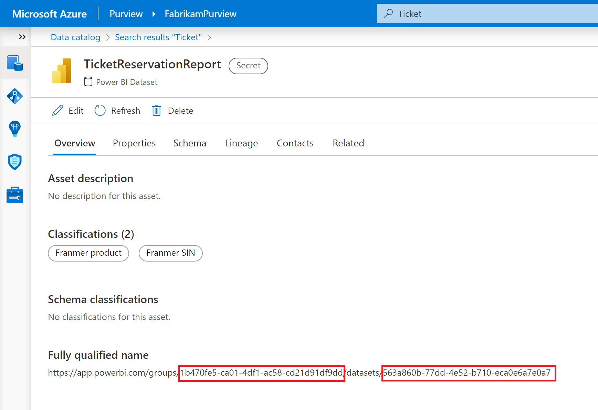
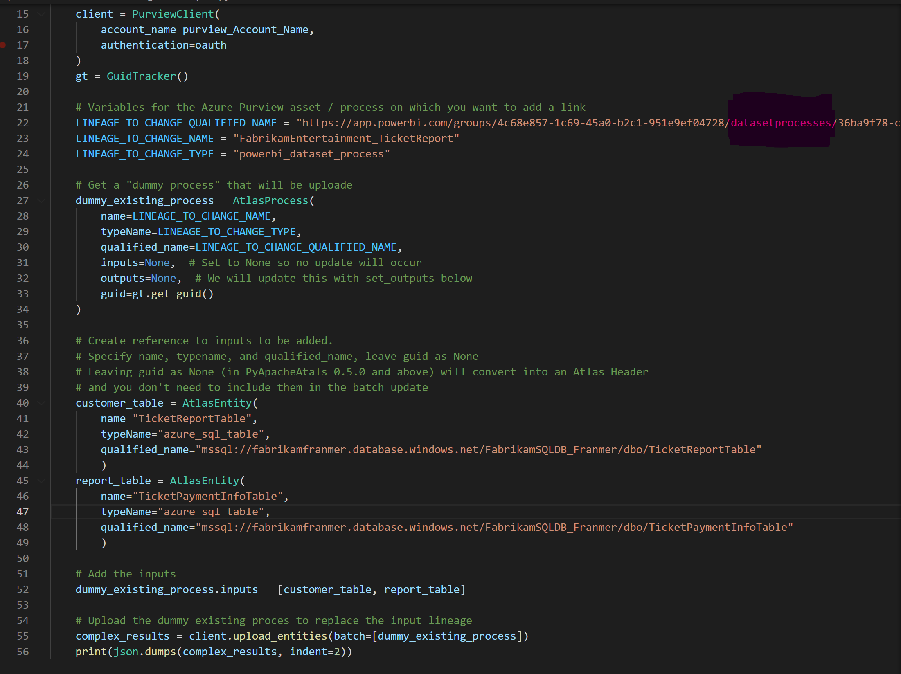

# Get full Power BI lineage in Azure Purview

Azure Purview has a connector to scan Power BI assets that are in both personal and collaborative workspaces. Azure Purview is also able to retrieve existing lineage from The Power BI service to make it available within Azure Purview Studio. In addition, Azure Purview also has the lineage of other assets that are sometimes used to create Power BI datasets. However, it lacks the link between these two lineages allowing to have a global vision of the movements and transformations of data, from the source to the Power BI dashboard to obtain a vision similar to the one below



By the way! Thank you [Will Johnson](https://github.com/wjohnson) for your help!

## Prerequisites

In order to run the script, it will be necessary:


- Install Python and pip (often bundled with Python installs)
- Visual Studio Code (or another code editor)
- Install PyApacheAtlas via pip
- Register an [application in Azure Active Directory (AAD)](https://docs.microsoft.com/en-us/azure/active-directory/develop/quickstart-register-app)
- Add this application as a **"Data Curator"** at the collection level **"Root"**. More details [here](https://docs.microsoft.com/en-us/azure/purview/catalog-permissions)
- [scan data sources](https://docs.microsoft.com/fr-us/azure/purview/purview-connector-overview) (Azure storage, databases, Tenant Power BI,.....)
- Use Azure Data Factory (ADF) or Azure Synapse Pipeline to [capture lineage information](https://docs.microsoft.com/en-us/azure/purview/catalog-lineage-user-guide)

## Scenario

After scanning our data sources, and if our data movements are orchestrated either via ADF or Azure Synapse Pipeline, we natively have 2 lineages:

A lineage representing the Power BI assets:


A lineage that starts from the source, the data lake, and ends in an Azure SQL Database as shown below.
The goal for me, is to link the 2 assets represented in red to the Power BI dataset to complete the lineage



## The script

To complete the lineage, we will use the python script below.

But first, we will need the following information:

- The **"Fuly qualified name"** of our Azure SQL assets. Below is an example for one of the Azure SQL assets:



The information of the **"Fuly qualified name"** of the Power BI asset. And yes! For Power BI datasets, there is a feint 😅. In the **"Fuly qualified name"**, replace *datasets* with *datasetprocesses*!





In the script below replace the values according to your environment. For the variable **name** it is nothing more or less than the name of the asset (in the case shown here, I can use the name *TicketReportTable*), even if you can put the name you want.

```Javascript
import json
import os
from pyapacheatlas.auth import ServicePrincipalAuthentication
from pyapacheatlas.core import PurviewClient, AtlasEntity, AtlasProcess
from pyapacheatlas.core.util import GuidTracker

if __name__ == "__main__":
    purview_Account_Name = "<YourAzurePurviewAccountName>"
    oauth = ServicePrincipalAuthentication(
        client_id="<Your Client ID>",
        tenant_id="<Your Tenant ID>",    
        client_secret="<Your Secret>"
    )
    client = PurviewClient(
        account_name=purview_Account_Name,
        authentication=oauth
    )
    gt = GuidTracker()
    
    # Variables for the Azure Purview asset / process on which you want to add a link    
    LINEAGE_TO_CHANGE_QUALIFIED_NAME = "https://app.powerbi.com/groups/<YOUR GROUP ID>/datasetprocesses/<YOUR DATASET ID>"    
    LINEAGE_TO_CHANGE_NAME = "FabrikamEntertainment_TicketReport"    
    LINEAGE_TO_CHANGE_TYPE = "powerbi_dataset_process"    
    
    # Get a "dummy process" that will be uploade    
    dummy_existing_process = AtlasProcess(
        name=LINEAGE_TO_CHANGE_NAME,
        typeName=LINEAGE_TO_CHANGE_TYPE,
        qualified_name=LINEAGE_TO_CHANGE_QUALIFIED_NAME,
        inputs=None,  # Set to None so no update will occur        
        outputs=None,  # We will update this with set_outputs below        
        guid=gt.get_guid()
    )
    
    # Create reference to inputs to be added. 
    # Specify name, typename, and qualified_name, leave guid as None    
    # Leaving guid as None (in PyApacheAtals 0.5.0 and above) will convert into an Atlas Header    
    # and you don't need to include them in the batch update        
    customer_table = AtlasEntity(
        name="<YOUR ASSET NAME>",
        typeName="azure_sql_table",
        qualified_name="<YOUR FULY QUALIFIED NAME>"    
        )
    report_table = AtlasEntity(
        name="<YOUR ASSET NAME>",
        typeName="azure_sql_table",
        qualified_name="<YOUR FULY QUALIFIED NAME>"    
        )
    
    # Add the inputs    
    dummy_existing_process.inputs = [customer_table, report_table]
    
    # Upload the dummy existing proces to replace the input lineage    
    complex_results = client.upload_entities(batch=[dummy_existing_process])
    print(json.dumps(complex_results, indent=2))
```

Below is a screenshot of my script in Visual Studio Code:



After executing the code, you should get a beautiful complete lineage as shown below:


A short video is available [here](https://github.com/franmer2/AzurePurviewFullPBILineage_US/tree/main/Video)